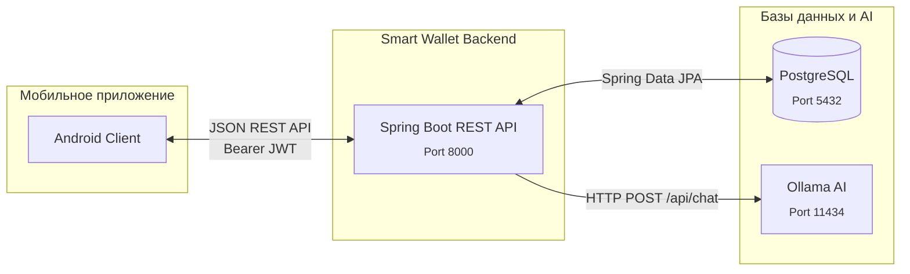

# Smart Wallet (Spring Boot Backend)

REST API бэкенда для мобильного приложения **Smart Wallet**: регистрация, аутентификация, управление банковскими картами, транзакциями, анализ расходов и получение рекомендаций от финансового AI-ассистента на основе Ollama.

Клиент общается с сервисом по **HTTPS** и **JSON REST**. Документация OpenAPI доступна по пути `/docs`.

## Архитектура системы

Мобильное приложение (Android) работает напрямую с REST API на базе Spring Boot. Бэкенд в свою очередь хранит данные в PostgreSQL и запрашивает AI-советы у локально развёрнутой нейросети через интерфейс Ollama (модель qwen2.5:1.5b или аналогичная). 



*При недоступности нейросети бэкенд использует встроенный локальный fallback, который предоставляет рекомендации на основе заранее заданных правил.*

## Стек технологий

* **Рантайм:** Java 21, Spring Boot 3.4.x
* **Web:** Spring Web MVC
* **Безопасность:** Spring Security, JWT (JJWT 0.12, HS256), BCrypt
* **БД:** PostgreSQL 16, Spring Data JPA, Flyway migrations
* **Ассистент:** Ollama (локальная LLM)
* **Документация:** springdoc-openapi (`/docs`)

## Основные API Endpoints

* **POST** `/auth/register` — регистрация пользователя
* **POST** `/auth/login` — получение JWT (access_token)
* **GET** `/auth/profile` — данные профиля
* **GET/POST** `/cards` — список карт / добавление новой
* **GET/POST** `/transactions` — история транзакций / создание транзакции (с авторасчётом кэшбэка)
* **GET** `/cashback/best-card` — рекомендация лучшей карты для оплаты
* **GET** `/assistant/recommendations` — получение персонализированных советов
* **POST** `/assistant/chat` — диалог с AI-ассистентом с учетом контекста трат

## Развёртывание с помощью Docker Compose

Приложение, база данных и локальная AI-модель разворачиваются с использованием `docker-compose`.

```bash
docker compose up -d --build
```

**Переменные окружения (`.env`):**
* `JWT_SECRET` — ключ подписи токенов (обязательно сменить в production)
* `POSTGRES_PASSWORD` — пароль для БД
* `ASSISTANT_OLLAMA_ENABLED` — включить AI-ассистента (true/false)
* `ASSISTANT_OLLAMA_MODEL` — используемая модель (например, `qwen2.5:1.5b`)

После запуска:
* API: `http://localhost:8000`
* Документация Swagger: `http://localhost:8000/docs`
