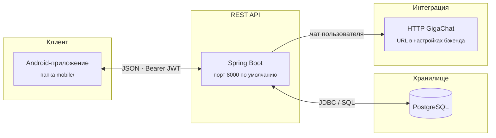

# Smart Wallet

Монорепозиторий: Android-клиент в каталоге `mobile/` и REST API на Spring Boot в `backend/`. Приложение работает с картами пользователя, транзакциями и кэшбэком, даёт подсказки по выбору карты и включает чат с ассистентом. Ответы ассистента запрашиваются на сервере у внешнего HTTP-сервиса (GigaChat), адрес задаётся в настройках бэкенда.

## Структура проекта

| Каталог / файл | Содержимое |
|----------------|------------|
| `mobile/` | Android приложение на Java |
| `backend/` | Сервис API, Maven |
| `docker-compose.yml` | PostgreSQL и контейнер API (сборка из `./backend`) |

## Клиент (mobile)

Стек можно описать как Java 11, Android Gradle Plugin 8.x, Gradle Kotlin DSL и каталог версий (`libs.versions.toml`), Retrofit и OkHttp, Gson с полем `SerializedName` под JSON в формате `snake_case`, Material и классический UI на XML-разметке (Fragments, без Jetpack Compose), ViewPager2, CameraX и ML Kit для сценария с кодом оплаты, Glide, MPAndroidChart.

Клиент общается с API по базовому URL из `BuildConfig.API_BASE_URL`. Значение задаётся в `mobile/local.properties` ключом `api.base.url`. Если файл не задан, в сборке подставляется адрес для эмулятора: `http://10.0.2.2:8000/` (тот же порт, что у Spring Boot по умолчанию). На физическом устройстве указывают IP машины с запущенным сервером, например `http://192.168.1.x:8000/`.

Подробнее про экраны и зависимости — в `mobile/README.md`.

Что есть в приложении с точки зрения пользователя: регистрация и вход, список карт и добавление карты, операции и история, подбор карты под категорию покупки, рекомендации и диалог ассистента, аналитика и профиль.

## Сервер (backend)

Стек: Java 21, Spring Boot 3.4.6, Spring Web MVC, Spring Security без сессии с JWT и BCrypt для паролей, PostgreSQL, Spring Data JPA и Flyway для схемы, springdoc-openapi (интерфейс `/docs`), Maven. Образ приложения описан в `backend/Dockerfile`.

Поток данных: клиент общается с API по HTTPS, после входа добавляет Bearer-токен к запросам. Сервер пишет состояние в PostgreSQL и по необходимости вызывает внешний GigaChat только с машины сервера. Отдельного BFF здесь нет — один Spring Boot-сервис и общая точка входа `/docs`, которой удобно пользоваться и мобильной команде для сверки полей.

### Схема взаимодействия



После запуска бэкенда к тем же методам удобно смотреть интерактивно: **`http://localhost:8000/docs`** (контракт собирает springdoc-openapi из аннотаций и сигнатур контроллеров).

Список маршрутов, переменные окружения и команды сборки подробнее — в **`backend/README.md`**.

## Замечания по согласованию клиента и API

Подходящее описание актуальных путей — открыть запущенный сервер по адресу `/docs`.

Сервер уже закрывает сценарии регистрации, входа, профиля, списков и создания карт и транзакций, рекомендаций, чата и запроса лучшей карты по категории.

В клиентских интерфейсах Retrofit заложены вызовы, для которых в текущей версии Spring Boot нет парных методов: загрузка аватара (`multipart`), демосид `POST …/demo/seed`, пакетный импорт транзакций, частичное обновление кэшбэка карты через `PATCH`. Пока эти методы не реализованы на сервере, соответствующие кнопки или сценарии будут получать ошибки. Тело успешного ответа после создания транзакции на сервере — объект с полями, а клиентский тип указан без разбора тела (`Void`), этого обычно достаточно для успешной записи без отображения ответа. В некоторых DTO транзакции на клиенте ожидаются поля, которых может не быть в упрощённом ответе сервера.

## Запуск

Сначала база и API из корня репозитория:

```bash
docker compose up --build -d
```

Проверка: сервис отвечает на `GET /health`, описание методов доступно по `GET /docs` того же хоста и порта (по умолчанию localhost:8000).

Для разработки бэкенда без контейнеров перейти в `backend/`, создать или указать локальную PostgreSQL как в `application.yml`, затем выполнить `mvn spring-boot:run`.

Клиент собирают в Android Studio, открыв каталог `mobile/`, добавив при необходимости `local.properties` с путём к SDK и нужным `api.base.url`.
