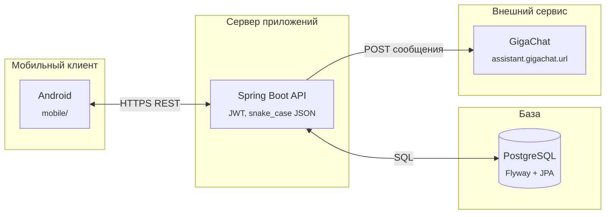

# Серверная часть Smart Wallet

Spring Boot приложение в этом каталоге отдаёт JSON API для Android-клиента из `mobile/`: учёт пользователей, карт и транзакций, расчёт кэшбэка, подсказки по карте под категорию, сохранённые рекомендации и чат через настраиваемый HTTP-сервис GigaChat.

## Стек

Используется Java 21 и Spring Boot **3.4.6** (родительский POM `spring-boot-starter-parent`), MVC для REST, Spring Security без сессии и JWT через библиотеку jjwt и алгоритм HS256, хранение паролей через BCrypt, PostgreSQL, JPA Hibernate, миграции Flyway и springdoc-openapi для генерации OpenAPI и страницы `/docs`.

Сборка — Maven (`pom.xml` в этом каталоге). Интеграционные проверки с поднятием PostgreSQL в контейнере описаны через Testcontainers для класса счастливого сценария; для этих тестов на машине должен быть доступен Docker.

## Устройство кода

Слой контроллеров принимает HTTP и переводит в DTO, сервисы держат бизнес-правила и обращение к внешнему помощнику, репозитории и сущности JPA работают с базой. Глобальная политика имён свойств JSON — `snake_case`, чтобы клиент мог совпасть при сериализации Gson.

Фильтр и сервис JWT проверяют заголовок `Authorization: Bearer …` на закрытых маршрутах. Отдельный клиент для GigaChat реализован на `RestTemplate` с конфигурируемыми таймаутами.

### Как запрос проходит по системе



### Устройство внутри приложения

```text
┌──────────────────────────────────────────────┐
│ Controllers · HTTP ↔ DTO, snake_case (Jackson)
└─────────────────────┬────────────────────────┘
                      │
┌─────────────────────▼────────────────────────┐
│ Services                                      │
│ Auth · Cards · Transactions · Cashback       │
│ Recommendations · Assistant                  │
└─────────────────────┬────────────────────────┘
                      │
┌─────────────────────▼────────────────────────┐
│ Repositories · сущности JPA · PostgreSQL     │
└──────────────────────────────────────────────┘

В обход этого контура точечно живут JwtAuthenticationFilter, JwtService
и клиент Gigachat (RestTemplate).
```

## Эндпоинты в двух словах

Метод | Путь | Назначение
------|------|------------
GET | `/` | Короткая информация о сервисе
GET | `/health` | Проверка доступности
POST | `/auth/register` | Регистрация
POST | `/auth/login` | Выдача JWT
GET | `/auth/profile` | Профиль по токену
GET / POST | `/cards`, `/cards/` | Список и создание карты
GET | `/cards/{id}` | Одна карта
GET / POST | `/transactions`, `/transactions/` | Список и создание операции с полем считанного кэшбэка
GET | `/assistant/recommendations` | До нескольких рекомендаций с учётом кэша за сутки
POST | `/assistant/chat` | Сообщение пользователя и ответ ассистента через GigaChat
GET | `/cashback/best-card` | Лучшая карта для переданной категории

Полная интерактивная форма вызовов и схемы тел после старта приложения: **`/docs`**, машиночитаемая схема — **`/v3/api-docs`**.

## Локальный запуск

Нужны JDK 21, Maven и работающий экземпляр PostgreSQL с базой и пользователем из `src/main/resources/application.yml` или переменные окружения вида `SPRING_DATASOURCE_URL`.

Из каталога `backend`:

```bash
mvn spring-boot:run
```

Порт приложения по умолчанию 8000, его можно поменять в конфигурации Spring.

Чувствительные настройки: строка подключения к БД, секрет JWT и минуты жизни токена, URL и таймауты клиента для GigaChat (`assistant.gigachat.*` в `application.yml`).

## Запуск в Docker вместе с базой

Файл `docker-compose.yml` лежит в корне монорепозитория и собирает сервис `api` из подкаталога `backend`. Из корня:

```bash
docker compose up --build -d
```

Базе выделяется том `smartwallet-pg-data`; пароли и имена задаются в том же файле Compose.

## Тесты

Из каталога `backend`:

```bash
mvn verify
```

Контейнерные тесты пропускаются, если Docker недоступен, согласно настройке Testcontainers в проекте.
