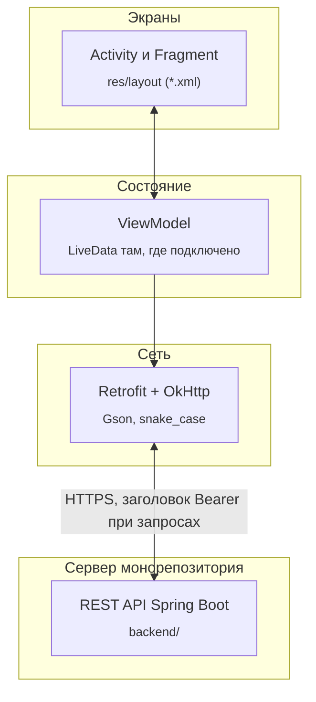

# Приложение Smart Wallet для Android

Нативный клиент на Java для учёта карт, просмотра операций и кэшбэка, экранов с рекомендациями и чатом с ассистентом. Серверную часть смотрите в каталоге `backend/` корня репозитория или в общем описании проекта (`README.md` в корне).

## Требования

Android Studio по выбору команды с поддержкой указанной в Gradle версии Kotlin DSL и JDK для сборки проекта (`compileSdk` 36, `minSdk` 26). Gradle Wrapper уже в каталоге `mobile/` — использовать его для воспроизводимости.

## Связь с сервером

Клиент собран вокруг Retrofit с базой из `BuildConfig.API_BASE_URL`. Добавьте или отредактируйте `local.properties` в этом каталоге:

```properties
sdk.dir=...
api.base.url=http://10.0.2.2:8000/
```

Часть перед слешем в конце — адрес машины с API. Для стандартного эмулятора Android Studio обычно подходит хост-машина по `10.0.2.2` и тот же порт, что у Spring Boot (по умолчанию 8000). Если `api.base.url` не указан, в сборке уже подставляется `http://10.0.2.2:8000/`.

После изменения базового адреса пересоберите приложение — значение попадает в `BuildConfig` на этапе компиляции.

Ответы бэкенда в JSON именуются в стиле `snake_case`; в коде приложения нужные свойства моделей помечены для Gson через `SerializedName`. Для авторизованных запросов интерцепторы не обёрнуты централизованно: токен в виде строки вида `Bearer …` добавляется в каждом вызове там, где он нужен.

## Стек технологий

На уровень приложения можно отнести Java 11, AndroidX AppCompat и Material, разметку экранов в XML без Jetpack Compose, навигацию через Activity и Fragments и ViewPager2 там, где предусмотрено макетом, паттерн представления через ViewModel и `LiveData` на части экранов (аналитика, история, чат), HTTP через Retrofit 2 и OkHttp с Gson, Glide для изображений, CameraX и ML Kit для сценария со сканированием кода, MPAndroidChart для графиков.

Подробнее о наборах зависимостей и версиях можно посмотреть в `gradle/libs.versions.toml` и `app/build.gradle.kts`.

### Схема на стороне клиента

Экраны строятся на XML-макетах и Java-коде, тяжёлая асинхронная работа частично уходит во ViewModel, сеть всегда выходит только через описанные Retrofit-интерфейсы к базовому URL.



## Структура исходников

Под `app/src/main/java` лежит пакет приложения (`com.example.smartwallet`): активности экранов, фрагменты, интерфейсы Retrofit под группы ресурсов (авторизация, карты, транзакции, ассистент, кэшбэк), модели данных DTO под ответы и запросы, вспомогательные утилиты, ViewModel для части тяжёлых экранов. Ресурсы — в `res/layout`, темы и строки в `res/values`, при необходимости отдельные правила для сетевой конфигурации в `xml`.

Отладочная конфигурация сети для HTTP на этапах разработки может отличаться от релиза — см. ресурсы `network_security_config` в приложении при странностях с открытым HTTP.

## Сборка и запуск

Откройте только каталог `mobile/` как Gradle-проект, дождитесь синхронизации, выберите конфигурацию запуска модуля `app` на эмуляторе или устройстве с доступом до адреса API.

Параллельно на машине должна быть доступна сборка или контейнер с API и базой, иначе сетевые вызовы завершатся ошибкой даже при успешном старте UI.

Если нужны особые разрешения на устройстве (камера, файлы под аватар или импорт), ориентируйтесь на комментарии в коде экранов и при необходимости документ с подсказками по правам в `PERMISSION_FIX_README.md`.

## Ограничения относительно текущего API

Не все методы, объявленные в коде клиента через Retrofit, имеют заготовку на серверной стороне. О реальных расхождениях между контрактом и Spring Boot см. блок «Замечания по согласованию» в корневом `README.md`, а актуальный перечень путей — в Swagger вашего деплоя (`/docs`).
